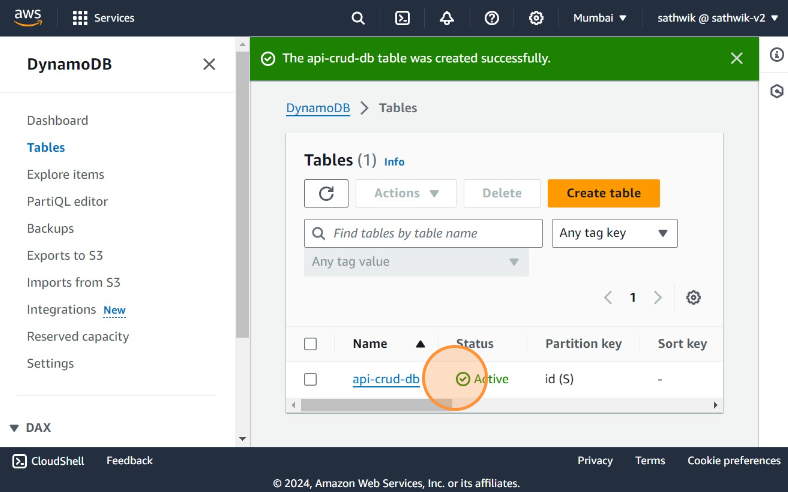
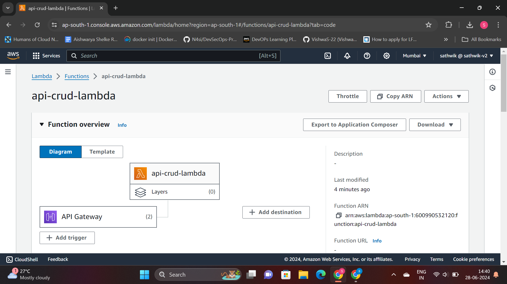
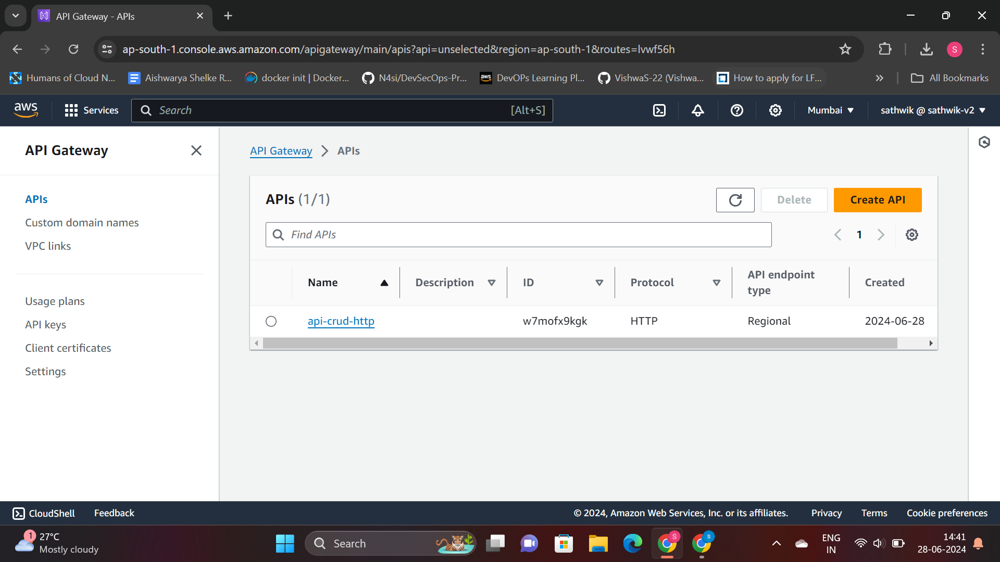
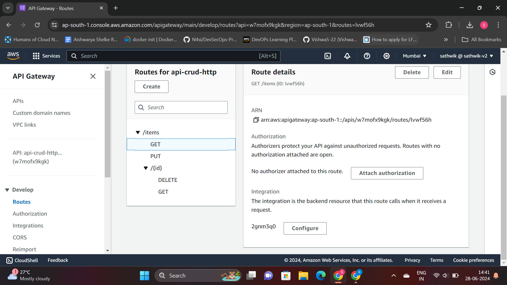
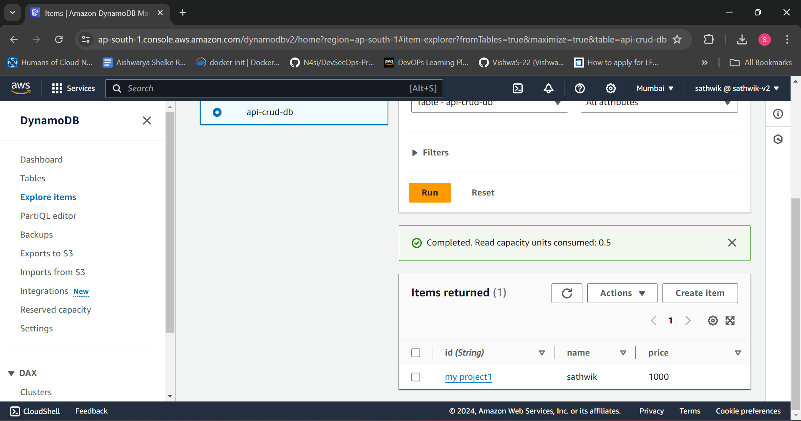

<h2>API that Creates, Reads, Updates, and Deletes items from a DynamoDB table. The API will run serverless, so there is no management of the underlying infrastructure and scaling is done automatically.</h2>

**When you invoke your HTTP API, API Gateway routes the request to your Lambda function. The Lambda function interacts with DynamoDB, and returns a response to the API Gateway. The API Gateway then returns a response to you.**

**Create a DynamoDB table**

**Create a lambda function**

**Create an HTTP API**

**Create routes and attach integration(lambda function) to routes**

**Testing the API**

